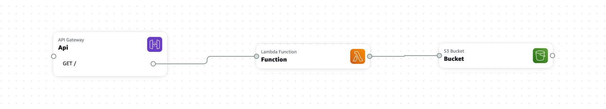

# AWS Application Composer - Demo project

This project was created as a LIVE demo during a talk at the [AWS User Group Roma](https://www.meetup.com/amazon-web-services-rome/).

The [`template.yaml`](/template.yaml) was entirely created in a visual way using [AWS Application Composer](https://aws.amazon.com/application-composer/)



This application consists of 3 main components:

- An API Gateway with a `GET /` endpoint
- A Lambda function (triggered by API Gateway)
- An S3 bucket where the Lambda function can create files

## Build and deployment

### Pre-requisites

To be able to deploy this project you will need:

- An AWS Account
- The [AWS CLI](https://aws.amazon.com/cli/) installed and configured in your machine
- The [AWS SAM](https://aws.amazon.com/serverless/sam/) CLI installed in your machine
- [Node.js](https://nodejs.org/) (18+) and NPM


### Node.js Dependencies

To install all the necessary Node.js modules:

```bash
cd src/Function
npm install
```

### Build

From the root folder:

```bash
sam build
```

### Deployment

```bash
sam deploy --guided
```

Follow the guided procedure to complete the deployment.

## Testing

Once you have your project deployed you can get the URL of your API Gateway endpoint from the API Gateway web console.

If you make a request to the API Gateway endpoint, you should receive a positive response and a new file will be created in the S3 bucket.

## Cleaning up

To clean up all the resources created by this template you need to delete all the files in the S3 bucket and then run:

```bash
sam delete
```

and follow the guided procedure.


## Contributing

Everyone is very welcome to contribute to this project.
You can contribute just by submitting bugs or suggesting improvements by
[opening an issue on GitHub](https://github.com/lmammino/aws-application-composer-demo/issues).


## License

Licensed under [MIT License](LICENSE). © Luciano Mammino.
